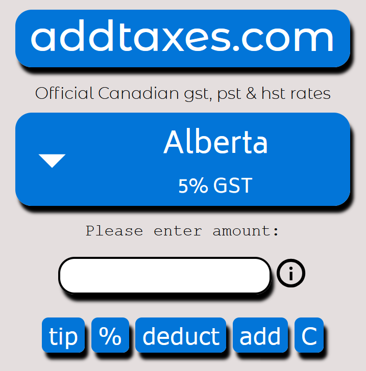

# addtaxes.com
### Canadian tax-calculator with official gst, pst and hst rates

This website is a simple tool for adding, deducting or calculating Canadian sales taxes. Listed prices in Canada are typically subject to sales taxes that vary by province or territory.

The tax calculator features a simple design built with pure JavaScript. Tax rates are determined by the selected province, and the selection is saved for future visits. Once loaded, the calculator can be used offline without an internet connection.

The add function applies the appropriate taxes to a given amount that excludes tax. The deduct function removes the tax from a total that already includes it, while the % function calculates the tax portion within a given amount.

The tax-calculator also includes a tipping function that adds a chosen percentage with a simple click.